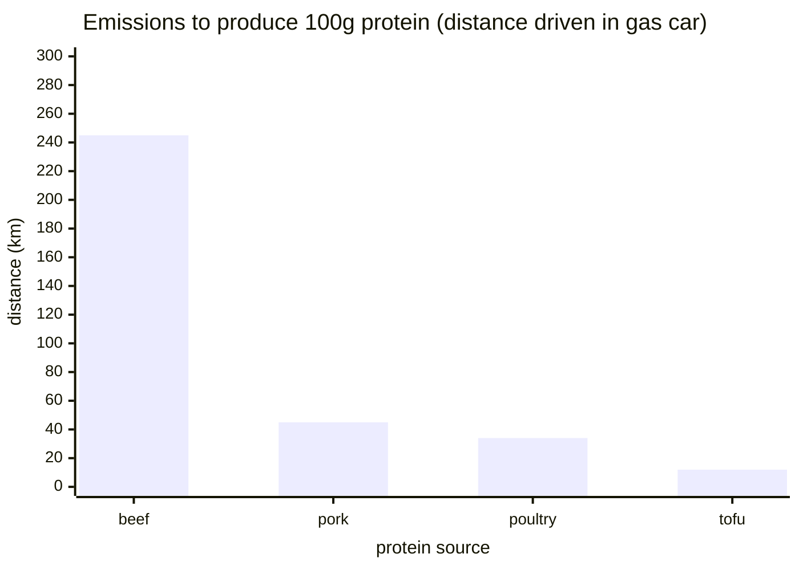

Around 5 years ago my wife and I made a conscious decision to cut out beef and lamb from our diets. Our decision was mostly based on graphs showing the exorbitant water consumption and methane emissions from raising cows, and also seeing one too many baby cows and lambs on a road trip from SF to Seattle.

When others ask about our reasoning, the answer is usually something along the lines of "it's a combination of health and environmental," but I don't _really_ know to what degree, and I've been wanting to gain a deeper understanding of the evidence.

# Relative emissions
My primary concern with beef consumption are the emissions that come from raising cows. The numbers provided by various studies are often relative, for example citing that "beef production emits 2–9 times the greenhouse gases (GHGs) of other animal products, and >50 times the GHGs of most plant‐based foods per unit of protein" [1]. However without the base absolute amount of emissions it's hard to assess impact of the additional emissions, since the absolute numbers could still be miniscule to begin with.

Our World in Data has some nice graphs that display the absolute value of emissions as stated by a 2018 Poore & Nemecek study [2]. It shows that on average producing 1 kg of beef will incur 99 kg of CO2eq emissions across its entire supply chain, which is around 2.5x of lamb, 8x of pork, 10x of chicken, 20x of eggs, and 31x of tofu (ok, still relative but bear with me).

<iframe src="https://ourworldindata.org/explorers/food-footprints?pickerSort=asc&hideControls=false&Commodity+or+Specific+Food+Product=Commodity&Environmental+Impact=Carbon+footprint&Kilogram+%2F+Protein+%2F+Calories=Per+kilogram&By+stage+of+supply+chain=true&country=Bananas~Beef+%28beef+herd%29~Beef+%28dairy+herd%29~Cheese~Eggs~Lamb+%26+Mutton~Milk~Maize~Nuts~Pig+Meat~Peas~Potatoes~Poultry+Meat~Rice~Tomatoes~Wheat+%26+Rye~Tofu+%28soybeans%29~Prawns+%28farmed%29~Tofu~Fish+%28farmed%29&tab=chart" loading="lazy" style="width: 100%; height: 600px; border: 0px none;" allow="web-share; clipboard-write"></iframe>

However for emissions from food I think normalizing by nutritional measures makes more sense than normalizing by mass. Here is the same graph normalizing per 100g of protein. Relatively speaking, beef is still 2.5x more expensive than lamb, only 6.5x of pork, 8.7x of poultry, 11.8x of eggs, and 25x of tofu. 

<iframe src="https://ourworldindata.org/explorers/food-footprints?pickerSort=asc&hideControls=false&Commodity+or+Specific+Food+Product=Commodity&Environmental+Impact=Carbon+footprint&Kilogram+%2F+Protein+%2F+Calories=Per+100+grams+of+protein&By+stage+of+supply+chain=false&country=Bananas~Beef+%28beef+herd%29~Beef+%28dairy+herd%29~Cheese~Eggs~Lamb+%26+Mutton~Milk~Maize~Nuts~Pig+Meat~Peas~Potatoes~Poultry+Meat~Rice~Tomatoes~Wheat+%26+Rye~Tofu+%28soybeans%29~Prawns+%28farmed%29~Tofu~Fish+%28farmed%29&tab=chart" loading="lazy" style="width: 100%; height: 600px; border: 0px none;" allow="web-share; clipboard-write"></iframe>

Great, these graphs confirm the previous statement that beef is 2-9x more emissive than other animal proteins and up to 50x more emissive than plant proteins. Here it's worth mentioning the difference between "beef (beef herd)" and "beef (dairy herd)". Dairy herd beef is a byproduct of dairy production that would otherwise be wasted and its emissions value is shared with that of the dairy produced in the cow's lifespan. The exact way the emissions are shared is not clear since various sources used by Poore & Nemecek do the split differently. The other factor is how much beef is dairy herd vs. beef herd and I've found sources which say dairy herd beef accounts for about 20-30% of the beef produced in the US.

Taking the average of 25% dairy herd and weight the emissions accordingly we get 41.6kg CO2eq as the estimated weighted average of emissions across both beef types. I'll use this number moving forward.

# Emissions in perspective
 While it's great to know that beef equivalent to 100g of protein costs 41.6kg of CO2 to produce, we need to put it into context. We can look at other activities that also produce 41.6kg of CO2eq.

Our World in Data has a similar emissions visualization for transportation, based on a 2022 report by the UK Government's Department for Energy Security and Net Zero [3].

<iframe src="https://ourworldindata.org/grapher/carbon-footprint-travel-mode?tab=chart" loading="lazy" style="width: 100%; height: 600px; border: 0px none;" allow="web-share; clipboard-write"></iframe>

The data shows 170g of CO2eq per km driven in a gas car and 148g of CO2eq per km on a long-haul flight. So in order to get 100g of protein from various food sources, it's equivalent to driving the following distances: 

For me that definitely puts the additional emissions from beef production into perspective.

That's it for now. It goes without saying that diet and consumer behaviour is a personal decision. I also didn't end up covering nutrition or other emissive activities like AI usage or air travel, but based on what I've found I'm confident standing by my decision to remove beef and lamb from my diet.

---

# Links
1. Reducing climate impacts of beef production: A synthesis of life cycle assessments across management systems and global regions https://pmc.ncbi.nlm.nih.gov/articles/PMC8248168/
	- "On average, beef production emits 2–9 times the greenhouse gases (GHGs) of other animal products, and >50 times the GHGs of most plant‐based foods per unit of protein"
2. https://ourworldindata.org/environmental-impacts-of-food
3. https://ourworldindata.org/travel-carbon-footprint
